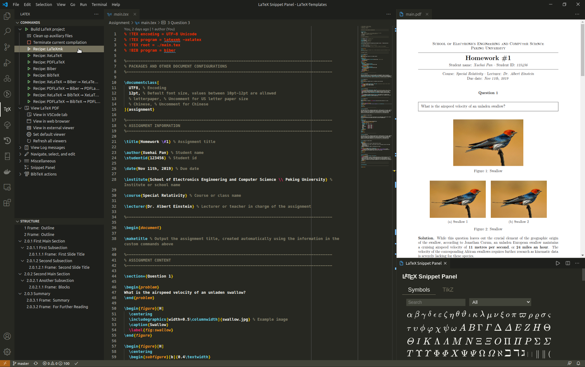

# LaTeX Templates

A collection of LaTeX templates.

## Editor Preparation

### Install VS Code and Extensions

**Visual Studio Code** is strongly recommended as editor for LaTeX projects. You can download and install it from the official site [https://code.visualstudio.com](https://code.visualstudio.com).

Recommended extensions:

- [LaTeX Workshop](https://marketplace.visualstudio.com/items?itemName=James-Yu.latex-workshop): boost LaTeX typesetting efficiency with preview, compile, autocomplete, colorize, and more.
- [Local History](https://marketplace.visualstudio.com/items?itemName=xyz.local-history): maintain local history of files.
- [Bracket Pair Colorizer 2](https://marketplace.visualstudio.com/items?itemName=CoenraadS.bracket-pair-colorizer-2):colorize matching brackets.

You can find them in Visual Studio Code Marketplace (ctrl / cmd + shift + X).

### Setup Editor for LaTeX Projects

```bash
# clone this repository
git clone https://github.com/XuehaiPan/LaTeX-Templates.git

# open the project with vscode
code LaTeX-Templates
```

Then install recommended extensions in [`".vscode/extensions.json"`](.vscode/extensions.json), and copy the settings in [`".vscode/settings.json"`](.vscode/settings.json) to your user settings. Refer to [XuehaiPan/OS-Setup/my-vscode-settings](https://github.com/XuehaiPan/OS-Setup/blob/master/my-vscode-settings/settings.json) as a reference.

## Usage

### Compile with LaTeX Workshop

```bash
code --new-window Assignment   # open a template folder using vscode
```

Open then main.tex file in vscode tab, then compile it with LaTeX-Workshop extension tool in the left panel, or use keyboard shortcut: `ctrl / cmd + alt + B`. Get more about the extension features from [wiki](https://github.com/James-Yu/LaTeX-Workshop/wiki).


### Manual Compilation

```bash
cd Assignment   # to the template folder
```

Compile with LaTeXmk (Recommended)
```bash
latexmk -xelatex -synctex=1 -interaction=nonstopmode -file-line-error -shell-escape main.tex
```

Compile with XeLaTeX and Biber
```bash
# XeLaTeX ➞ Biber ➞ XeLaTeX × 2
xelatex -synctex=1 -interaction=nonstopmode -file-line-error -shell-escape main
biber main
xelatex -synctex=1 -interaction=nonstopmode -file-line-error -shell-escape main
xelatex -synctex=1 -interaction=nonstopmode -file-line-error -shell-escape main
```

Screenshot:


